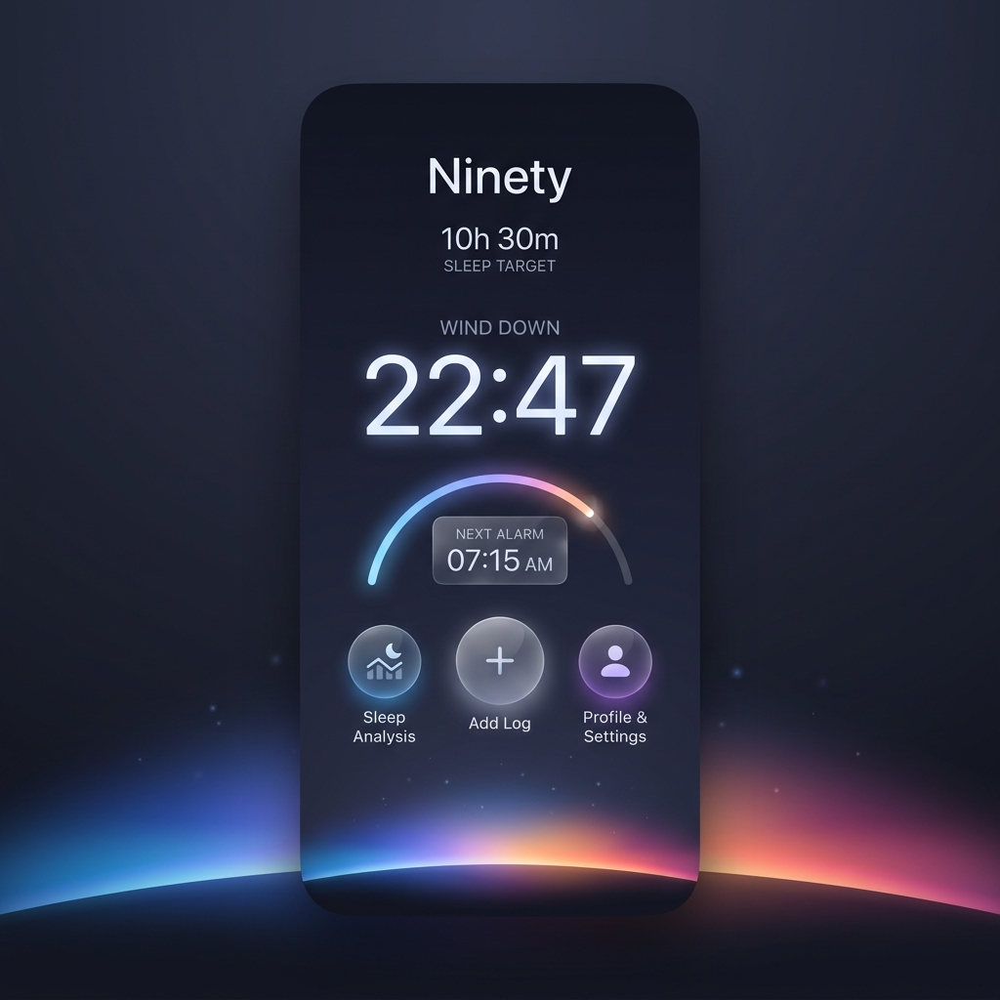

# Ninety - The Intelligent Wake-Up System

`SwiftUI` `CoreML` `watchOS` `iOS 17+`

Ninety is a high-end, privacy-focused sleep tracking and smart alarm system. Unlike traditional alarms that wake you at a fixed time regardless of your sleep state, Ninety leverages **on-device Machine Learning** to detect your optimal wake-up moment during light sleep, ensuring you start your day refreshed and energized.

## 🧠 The Core Logic: "The 30-Minute Window"

Ninety doesn't just track; it acts. The system is designed around a precision monitoring window:
1. **Dynamic Monitoring**: Thirty minutes before your set wake-up time, Ninety activates the Apple Watch sensors.
2. **On-Device Classification**: Using a custom CoreML model (`modello25`), the app processes real-time Heart Rate and Accelerometer data to classify your sleep stages (**Wake, Light, Deep, REM**).
3. **Intelligent Trigger**: The alarm is triggered the moment the model identifies a transition into **Light Sleep**. If no optimal phase is found, the failsafe alarm wakes you at your exact requested time.

## ✨ Key Features

- **Synergistic Ecosystem**: Seamless communication between iPhone and Apple Watch via `WatchConnectivity`. The Watch handles high-frequency sensor acquisition, while the iPhone performs the heavy ML lifting.
- **Privacy by Design**: No servers, no cloud, no data harvesting. Your heart rate and movement data are processed entirely on your devices.
- **Liquid Glass UI**: A stunning, state-of-the-art design system featuring gasmorphic elements, breathing horizon animations, and tactile interactions.
- **Siri & App Intents**: Fully integrated with Siri. Set, update, or check your sleep schedule using voice commands or the Shortcuts app.
- **Diagnostic Suite**: Built-in developer tools to monitor log streams, ML classification snapshots, and sensor health in real-time.

## 🛠 Tech Stack

- **Framework**: SwiftUI (Interface), Combine (Reactive data streams).
- **Intelligence**: CoreML (Random Forest Classifier for sleep staging).
- **Communication**: WatchConnectivity (Message relay and UserInfo background transfer).
- **Hardware**: HealthKit (Heart Rate data), CoreMotion (50Hz Accelerometer variance).

## 🚀 Getting Started

1. **Environment**: Ensure you are using Xcode 15+ and targeting iOS 17.0+ and watchOS 10.0+.
2. **Setup**:
   - Clone this repository.
   - Open `Ninety.xcodeproj`.
   - Ensure the Bundle Identifier and Team are set correctly for both the iOS and Watch targets.
3. **Deployment**:
   - Install the app on both your iPhone and Apple Watch.
   - Grant HealthKit and Notification permissions on both devices.
   - Set your wake-up time on the iPhone and let Ninety handle the rest.

## 📱 Compatibility

- **OS**: iOS 17.0+ / watchOS 10.0+
- **Hardware**: iPhone (XS or newer) + Apple Watch (Series 4 or newer)

---
*Ninety: Precision waking for a better life.*
